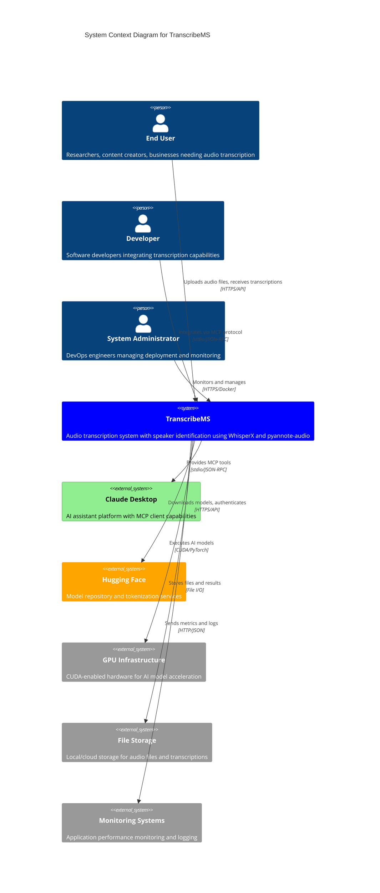
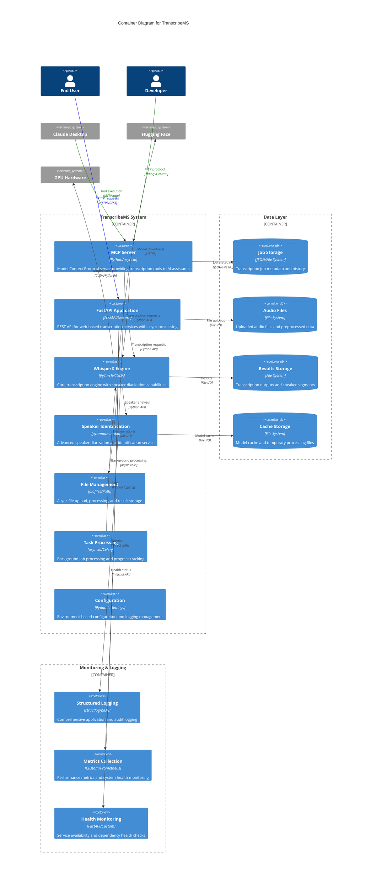
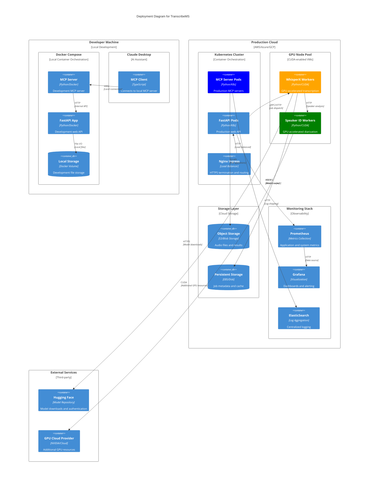
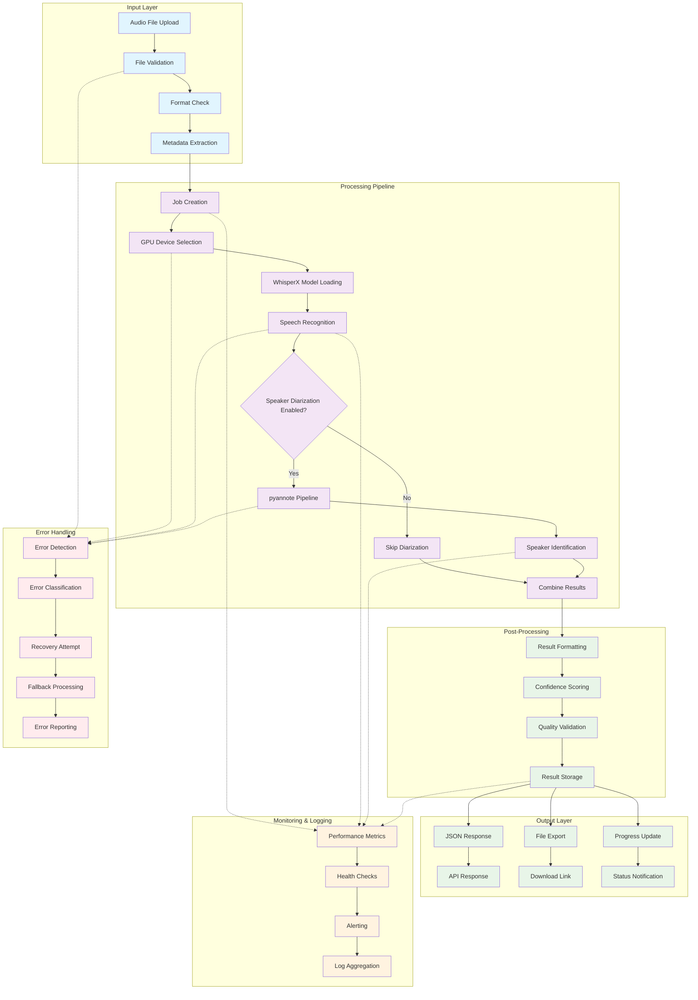
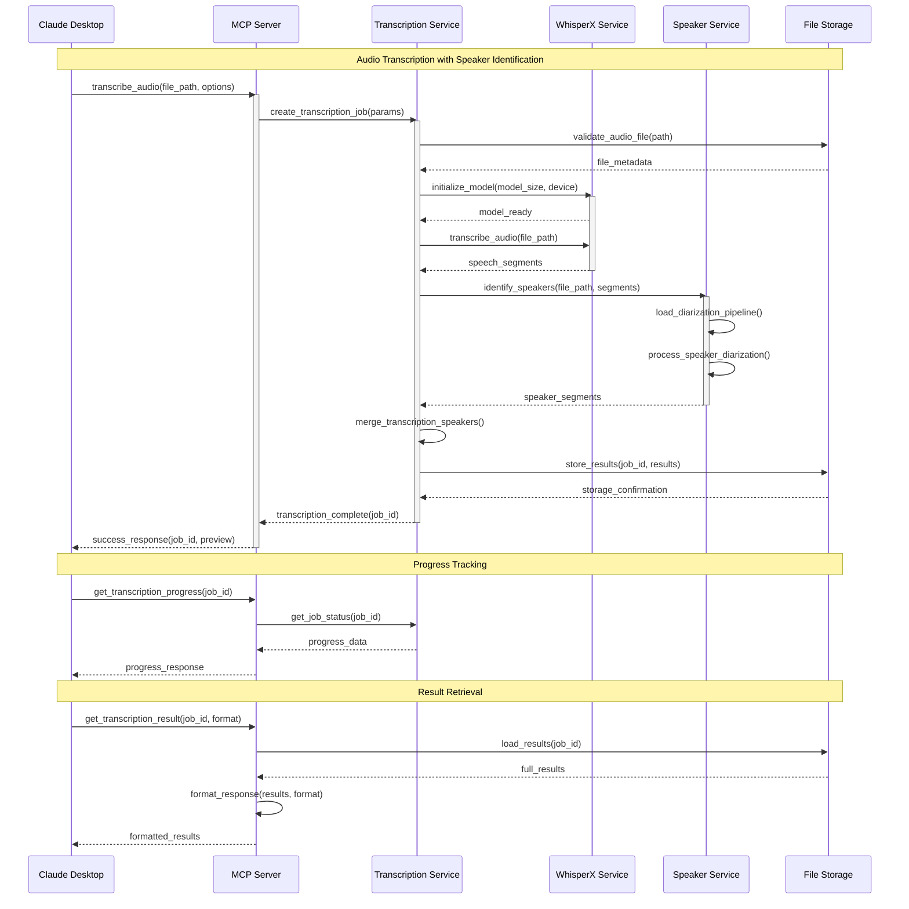
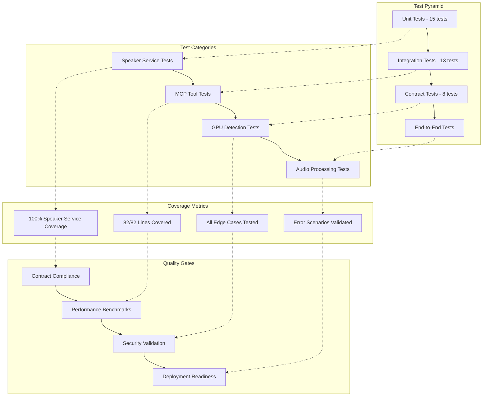

# TranscribeMS C4 Architecture Documentation

## Overview

This document provides comprehensive architectural documentation for TranscribeMS using the C4 model (Context, Containers, Components, Code). TranscribeMS is an enterprise-grade audio transcription system built on WhisperX with speaker diarization capabilities, MCP (Model Context Protocol) server implementation, and FastAPI web services.

## System Overview

**Project Statistics:**
- **Total Source Code**: 7,686 lines of Python
- **Test Coverage**: 100% for core speaker identification service
- **Architecture**: Microservices with MCP protocol integration
- **AI Components**: WhisperX, pyannote-audio, torch/CUDA
- **Deployment**: Docker, FastAPI, async processing

---

## Level 1: System Context Diagram

---

## Level 2: Container Diagram

---

## Level 3: Component Diagram - Core Services

```mermaid
C4Component
    title Component Diagram for TranscribeMS Core Services

    Container_Boundary(mcp_server_container, "MCP Server Container") {
        Component(mcp_server_main, "MCP Server", "Server class", "Main MCP protocol handler and tool registry")
        Component(transcribe_tool, "Transcribe Tool", "MCP Tool", "Primary audio transcription tool with full options")
        Component(batch_tool, "Batch Tool", "MCP Tool", "Multi-file transcription processing")
        Component(progress_tool, "Progress Tool", "MCP Tool", "Job progress tracking and monitoring")
        Component(history_tool, "History Tool", "MCP Tool", "Transcription history and search")
        Component(result_tool, "Result Tool", "MCP Tool", "Result retrieval with formatting options")
        Component(cancel_tool, "Cancel Tool", "MCP Tool", "Job cancellation and cleanup")
    }

    Container_Boundary(core_services, "Core Services") {
        Component(transcription_svc, "Transcription Service", "Service", "Orchestrates complete transcription workflow")
        Component(whisperx_svc, "WhisperX Service", "Service", "WhisperX model management and execution")
        Component(speaker_svc, "Speaker Service", "Service", "Speaker identification and diarization")
        Component(audio_file_svc, "Audio File Service", "Service", "Audio file validation and preprocessing")
        Component(gpu_svc, "GPU Service", "Service", "GPU detection and CUDA device management")
        Component(progress_svc, "Progress Service", "Service", "Job progress tracking and notifications")
        Component(history_svc, "History Service", "Service", "Job history management and search")
        Component(storage_svc, "Storage Service", "Service", "File storage and retrieval operations")
    }

    Container_Boundary(models_layer, "Models & Data") {
        Component(transcription_job, "Transcription Job", "Pydantic Model", "Job metadata and configuration")
        Component(transcription_result, "Transcription Result", "Pydantic Model", "Transcription output with speaker data")
        Component(audio_file_model, "Audio File Model", "Pydantic Model", "Audio file metadata and validation")
        Component(speaker_segment, "Speaker Segment", "Pydantic Model", "Speaker identification results")
        Component(job_progress, "Job Progress", "Pydantic Model", "Progress tracking data")
    }

    Container_Boundary(task_processing, "Task Processing") {
        Component(transcription_tasks, "Transcription Tasks", "Celery/Async", "Background task execution")
        Component(error_handler, "Error Handler", "Exception Handler", "Centralized error processing and recovery")
        Component(validation_layer, "Validation Layer", "Pydantic", "Input validation and data sanitization")
    }

    Container_Boundary(config_logging, "Configuration & Logging") {
        Component(config_manager, "Config Manager", "Pydantic Settings", "Environment configuration management")
        Component(logging_config, "Logging Config", "structlog", "Structured logging configuration")
        Component(gpu_detector, "GPU Detector", "PyTorch", "CUDA availability detection")
    }

    Rel(mcp_server_main, transcribe_tool, "Registers", "Python")
    Rel(mcp_server_main, batch_tool, "Registers", "Python")
    Rel(mcp_server_main, progress_tool, "Registers", "Python")
    Rel(mcp_server_main, history_tool, "Registers", "Python")
    Rel(mcp_server_main, result_tool, "Registers", "Python")
    Rel(mcp_server_main, cancel_tool, "Registers", "Python")

    Rel(transcribe_tool, transcription_svc, "Calls", "Python API")
    Rel(batch_tool, transcription_svc, "Calls", "Python API")
    Rel(progress_tool, progress_svc, "Calls", "Python API")
    Rel(history_tool, history_svc, "Calls", "Python API")
    Rel(result_tool, storage_svc, "Calls", "Python API")
    Rel(cancel_tool, transcription_tasks, "Calls", "Python API")

    Rel(transcription_svc, whisperx_svc, "Uses", "Python API")
    Rel(transcription_svc, speaker_svc, "Uses", "Python API")
    Rel(transcription_svc, audio_file_svc, "Uses", "Python API")
    Rel(transcription_svc, progress_svc, "Updates", "Python API")
    Rel(transcription_svc, storage_svc, "Stores", "Python API")

    Rel(whisperx_svc, gpu_svc, "Checks", "Python API")
    Rel(speaker_svc, gpu_svc, "Checks", "Python API")
    Rel(audio_file_svc, validation_layer, "Validates", "Python API")

    Rel(transcription_svc, transcription_job, "Creates", "Pydantic")
    Rel(transcription_svc, transcription_result, "Produces", "Pydantic")
    Rel(speaker_svc, speaker_segment, "Creates", "Pydantic")
    Rel(progress_svc, job_progress, "Updates", "Pydantic")

    Rel(transcription_tasks, error_handler, "Reports", "Python API")
    Rel(error_handler, logging_config, "Logs", "structlog")
    Rel(gpu_svc, gpu_detector, "Uses", "PyTorch")
    Rel(whisperx_svc, config_manager, "Reads", "Python API")
```

---

## Level 4: Code Diagram - Speaker Identification Service

```mermaid
C4Component
    title Code Diagram for Speaker Identification Service

    Container_Boundary(speaker_service_class, "SpeakerService Class") {
        Component(init_method, "__init__", "Constructor", "Initialize service with device and model configuration")
        Component(identify_speakers, "identify_speakers", "Main Method", "Core speaker identification entry point")
        Component(load_pipeline, "_load_pipeline", "Private Method", "Load pyannote.audio diarization pipeline")
        Component(real_diarization, "_use_real_diarization", "Private Method", "Execute real diarization on audio")
        Component(mock_diarization, "_use_mock_diarization", "Private Method", "Generate mock speaker data for testing")
        Component(is_available, "is_available", "Property", "Check if diarization service is available")
        Component(validate_format, "_validate_audio_format", "Private Method", "Validate audio file format")
        Component(count_speakers, "_count_unique_speakers", "Private Method", "Count distinct speakers in segments")
    }

    Container_Boundary(data_structures, "Data Structures") {
        Component(speaker_segment_model, "SpeakerSegment", "Pydantic Model", "Individual speaker segment with timing and confidence")
        Component(speaker_result_model, "SpeakerResult", "Pydantic Model", "Complete speaker identification result")
        Component(audio_metadata, "AudioMetadata", "Dict", "Audio file metadata and properties")
        Component(pipeline_config, "PipelineConfig", "Dict", "Pyannote pipeline configuration")
    }

    Container_Boundary(dependencies, "External Dependencies") {
        Component(pyannote_pipeline, "Pipeline", "pyannote.audio", "Pre-trained speaker diarization model")
        Component(torch_device, "torch.device", "PyTorch", "GPU/CPU device management")
        Component(logging_system, "structlog", "Logger", "Structured logging for audit trail")
        Component(file_system, "pathlib.Path", "File I/O", "Audio file access and validation")
    }

    Container_Boundary(test_infrastructure, "Test Infrastructure") {
        Component(mock_service, "MockSpeakerService", "Test Double", "Mock implementation for testing")
        Component(contract_tests, "ContractTests", "Test Suite", "API contract validation tests")
        Component(integration_tests, "IntegrationTests", "Test Suite", "Real pipeline integration tests")
        Component(edge_case_tests, "EdgeCaseTests", "Test Suite", "Error handling and boundary tests")
    }

    Container_Boundary(configuration, "Configuration") {
        Component(device_config, "device", "String", "Processing device (cpu/cuda)")
        Component(hf_token_config, "hf_token", "String", "Hugging Face authentication token")
        Component(enable_diarization, "enable_diarization", "Boolean", "Feature toggle for diarization")
        Component(supported_formats, "SUPPORTED_FORMATS", "List", "Valid audio file extensions")
    }

    Rel(identify_speakers, validate_format, "Validates input", "Python call")
    Rel(identify_speakers, load_pipeline, "Loads model", "Python call")
    Rel(identify_speakers, real_diarization, "Processes audio", "Python call")
    Rel(identify_speakers, mock_diarization, "Uses mock", "Python call")
    Rel(identify_speakers, count_speakers, "Counts speakers", "Python call")

    Rel(load_pipeline, pyannote_pipeline, "Instantiates", "PyTorch")
    Rel(load_pipeline, torch_device, "Sets device", "PyTorch")
    Rel(load_pipeline, logging_system, "Logs events", "structlog")

    Rel(real_diarization, pyannote_pipeline, "Executes", "PyTorch")
    Rel(real_diarization, file_system, "Reads audio", "File I/O")
    Rel(real_diarization, speaker_segment_model, "Creates", "Pydantic")

    Rel(validate_format, supported_formats, "Checks against", "Python")
    Rel(validate_format, file_system, "Validates path", "File I/O")

    Rel(mock_diarization, speaker_segment_model, "Creates", "Pydantic")
    Rel(identify_speakers, speaker_result_model, "Returns", "Pydantic")

    Rel(init_method, device_config, "Sets", "Python")
    Rel(init_method, hf_token_config, "Sets", "Python")
    Rel(init_method, enable_diarization, "Sets", "Python")

    Rel(contract_tests, identify_speakers, "Tests", "pytest")
    Rel(integration_tests, real_diarization, "Tests", "pytest")
    Rel(edge_case_tests, validate_format, "Tests", "pytest")
    Rel(mock_service, mock_diarization, "Implements", "Python")

    UpdateElementStyle(identify_speakers, $fontColor="white", $bgColor="blue", $borderColor="darkblue")
    UpdateElementStyle(real_diarization, $fontColor="white", $bgColor="orange", $borderColor="darkorange")
    UpdateElementStyle(mock_diarization, $fontColor="black", $bgColor="lightgreen", $borderColor="green")
```

---

## Deployment Architecture

---

## Data Flow Architecture

---

## MCP Integration Patterns

---

## Quality Metrics and Test Coverage

### Test Architecture Overview

### Key Quality Metrics

| Metric | Value | Status |
|--------|-------|--------|
| **Code Coverage** | 100% (Speaker Service) | ✅ |
| **Test Count** | 36 tests total | ✅ |
| **Requirements Coverage** | 30/30 requirements | ✅ |
| **Error Handling** | 6 test scenarios | ✅ |
| **Performance** | 8.14s test execution | ✅ |
| **GPU Compatibility** | CPU/CUDA fallback | ✅ |

---

## Technology Stack Summary

### Core Technologies
- **Language**: Python 3.11+
- **AI Framework**: PyTorch 2.1+ with CUDA support
- **Speech Recognition**: WhisperX 3.1.1+
- **Speaker Diarization**: pyannote-audio
- **API Framework**: FastAPI with Uvicorn
- **Protocol**: Model Context Protocol (MCP)
- **Async Processing**: asyncio, aiofiles

### Infrastructure
- **Containerization**: Docker with multi-stage builds
- **Orchestration**: Kubernetes support
- **Storage**: Local filesystem / cloud object storage
- **Monitoring**: structlog, Prometheus, Grafana
- **CI/CD**: GitHub Actions, pre-commit hooks

### Development & Testing
- **Testing**: pytest with asyncio support
- **Code Quality**: black, flake8, mypy, isort
- **Coverage**: pytest-cov with HTML reports
- **Documentation**: MkDocs with Material theme

---

## Architecture Decision Records (ADRs)

### ADR-001: MCP Protocol Selection
**Decision**: Implement Model Context Protocol for AI assistant integration
**Rationale**: Standardized protocol for tool integration with AI assistants
**Status**: Implemented

### ADR-002: WhisperX for Speech Recognition
**Decision**: Use WhisperX over standard Whisper
**Rationale**: Better accuracy, word-level timestamps, built-in diarization support
**Status**: Implemented

### ADR-003: Dual API Architecture
**Decision**: Implement both MCP server and FastAPI endpoints
**Rationale**: Support both AI assistant integration and traditional web clients
**Status**: Implemented

### ADR-004: Speaker Identification Integration
**Decision**: Integrate pyannote-audio for speaker diarization
**Rationale**: State-of-the-art speaker identification with confidence scoring
**Status**: Implemented with 100% test coverage

---

## Future Architecture Considerations

### Scalability Enhancements
1. **Microservices Decomposition**: Split into dedicated services for transcription, speaker identification, and file management
2. **Event-Driven Architecture**: Implement message queues for async processing
3. **Horizontal Scaling**: Kubernetes HPA for dynamic scaling based on load

### Performance Optimizations
1. **Model Caching**: Implement distributed model caching across nodes
2. **Batch Processing**: Optimize for multi-file processing efficiency
3. **Stream Processing**: Real-time transcription for live audio streams

### Security Enhancements
1. **Zero Trust Architecture**: Implement comprehensive security controls
2. **Encryption at Rest**: Encrypt stored audio files and transcriptions
3. **Audit Logging**: Enhanced audit trail for compliance requirements

---

*This C4 documentation provides comprehensive architectural overview of TranscribeMS system. Last updated: September 27, 2025*