# Data Model: TranscribeMS MCP Server

**Date**: 2025-09-25
**Feature**: Convert TranscribeMS API to MCP Server
**Branch**: 002-adjust-the-current

## Core Entities

### AudioFile
Represents an input audio file for transcription processing.

**Fields**:
- `file_path`: str - Absolute path to the audio file
- `file_name`: str - Original filename with extension
- `file_size`: int - File size in bytes (max 1GB = 1,073,741,824 bytes)
- `duration`: float - Audio duration in seconds (calculated after loading)
- `format`: str - Audio format (MP3, WAV, M4A, OGG, FLAC, AAC, WMA)
- `sample_rate`: int - Audio sample rate in Hz
- `channels`: int - Number of audio channels (1=mono, 2=stereo)
- `created_at`: datetime - When the file was first processed
- `checksum`: str - SHA256 hash for file integrity verification

**Validation Rules**:
- `file_path` must exist and be readable
- `file_size` must be ≤ 1,073,741,824 bytes (1GB)
- `format` must be in allowed list: [MP3, WAV, M4A, OGG, FLAC, AAC, WMA]
- `duration` must be > 0 seconds
- `sample_rate` must be > 0 Hz

**State Transitions**:
1. `discovered` → File path provided, basic validation passed
2. `analyzed` → Audio metadata extracted, format validated
3. `ready` → File prepared for transcription processing
4. `error` → Validation failed or file inaccessible

### TranscriptionJob
Represents a transcription processing task with progress tracking.

**Fields**:
- `job_id`: str - Unique identifier (UUID4)
- `audio_file`: AudioFile - Reference to source audio file
- `status`: JobStatus - Current processing status
- `progress`: float - Completion percentage (0.0-1.0)
- `started_at`: datetime - When transcription processing began
- `completed_at`: datetime | None - When processing completed
- `error_message`: str | None - Error description if failed
- `settings`: TranscriptionSettings - Processing configuration
- `estimated_duration`: float | None - Estimated processing time in seconds
- `current_chunk`: int - Current chunk being processed (for progress)
- `total_chunks`: int - Total number of chunks to process

**Validation Rules**:
- `job_id` must be unique UUID4 format
- `progress` must be between 0.0 and 1.0
- `started_at` must be ≤ current time
- `completed_at` must be ≥ `started_at` if set
- `current_chunk` must be ≤ `total_chunks`

**State Transitions**:
1. `pending` → Job created, queued for processing
2. `processing` → Transcription in progress
3. `completed` → Transcription successful
4. `failed` → Error occurred during processing
5. `cancelled` → User cancelled the job

### TranscriptionResult
Contains the complete transcription output with metadata.

**Fields**:
- `job_id`: str - Reference to originating TranscriptionJob
- `text`: str - Full transcribed text content
- `segments`: List[TranscriptionSegment] - Word/phrase level segments
- `speakers`: List[Speaker] - Identified speakers (if diarization enabled)
- `confidence_score`: float - Overall transcription confidence (0.0-1.0)
- `processing_time`: float - Total processing time in seconds
- `model_version`: str - WhisperX model version used
- `language`: str - Detected/specified language code (ISO 639-1)
- `word_count`: int - Total number of transcribed words
- `metadata`: TranscriptionMetadata - Additional processing information

**Validation Rules**:
- `confidence_score` must be between 0.0 and 1.0
- `processing_time` must be > 0 seconds
- `language` must be valid ISO 639-1 code
- `word_count` must match actual word count in text
- `segments` list must be ordered by start_time

**Relationships**:
- One-to-one with TranscriptionJob
- One-to-many with TranscriptionSegment
- One-to-many with Speaker (if speaker diarization used)

### TranscriptionSegment
Represents a time-bounded segment of transcribed audio with speaker information.

**Fields**:
- `segment_id`: str - Unique segment identifier
- `start_time`: float - Segment start time in seconds
- `end_time`: float - Segment end time in seconds
- `text`: str - Transcribed text for this segment
- `confidence`: float - Confidence score for this segment (0.0-1.0)
- `speaker_id`: str | None - Speaker identifier (if diarization enabled)
- `words`: List[Word] - Individual word-level details
- `language`: str - Language code for this segment

**Validation Rules**:
- `start_time` must be ≥ 0.0 seconds
- `end_time` must be > `start_time`
- `confidence` must be between 0.0 and 1.0
- `text` must not be empty
- `words` list must be ordered by start_time
- `language` must be valid ISO 639-1 code

**Relationships**:
- Many-to-one with TranscriptionResult
- One-to-many with Word
- Many-to-one with Speaker (if speaker_id provided)

### Word
Represents individual word-level transcription data with precise timing.

**Fields**:
- `word`: str - The transcribed word
- `start_time`: float - Word start time in seconds
- `end_time`: float - Word end time in seconds
- `confidence`: float - Confidence score for this word (0.0-1.0)
- `probability`: float - Model probability for this word choice

**Validation Rules**:
- `word` must not be empty or whitespace only
- `start_time` must be ≥ 0.0 seconds
- `end_time` must be > `start_time`
- `confidence` must be between 0.0 and 1.0
- `probability` must be between 0.0 and 1.0

**Relationships**:
- Many-to-one with TranscriptionSegment

### Speaker
Represents an identified speaker in multi-speaker audio with diarization.

**Fields**:
- `speaker_id`: str - Unique speaker identifier (e.g., "SPEAKER_00")
- `speaker_label`: str | None - Human-readable speaker label (optional)
- `total_speech_time`: float - Total speaking time in seconds
- `segment_count`: int - Number of segments attributed to this speaker
- `confidence`: float - Overall speaker identification confidence
- `characteristics`: Dict[str, Any] - Speaker characteristics (pitch, gender estimates)

**Validation Rules**:
- `speaker_id` must follow pattern "SPEAKER_\d\d"
- `total_speech_time` must be > 0.0 seconds
- `segment_count` must be > 0
- `confidence` must be between 0.0 and 1.0

**Relationships**:
- One-to-many with TranscriptionSegment
- Many-to-one with TranscriptionResult

## Supporting Types

### JobStatus (Enum)
- `PENDING` = "pending"
- `PROCESSING` = "processing"
- `COMPLETED` = "completed"
- `FAILED` = "failed"
- `CANCELLED` = "cancelled"

### TranscriptionSettings
Configuration parameters for transcription processing.

**Fields**:
- `model_size`: str - WhisperX model size ("tiny", "base", "small", "medium", "large")
- `language`: str | None - Force specific language (ISO 639-1), None for auto-detect
- `enable_diarization`: bool - Enable speaker diarization
- `chunk_length`: int - Audio chunk length in seconds (default: 30)
- `device`: str - Processing device ("cpu", "cuda", "mps")
- `compute_type`: str - Compute precision ("float16", "float32")

### TranscriptionMetadata
Additional metadata about the transcription process.

**Fields**:
- `whisperx_version`: str - WhisperX library version used
- `model_path`: str - Path to the model files used
- `device_used`: str - Actual device used for processing
- `memory_usage`: float - Peak memory usage in MB
- `chunks_processed`: int - Number of audio chunks processed
- `diarization_enabled`: bool - Whether speaker diarization was used
- `preprocessing_time`: float - Time spent on audio preprocessing
- `inference_time`: float - Time spent on model inference
- `postprocessing_time`: float - Time spent on result processing

## Data Relationships

```mermaid
erDiagram
    AudioFile {
        string file_path PK
        string file_name
        int file_size
        float duration
        string format
        int sample_rate
        int channels
        datetime created_at
        string checksum
    }

    TranscriptionJob {
        string job_id PK
        string audio_file_path FK
        string status
        float progress
        datetime started_at
        datetime completed_at
        string error_message
    }

    TranscriptionResult {
        string job_id PK, FK
        string text
        float confidence_score
        float processing_time
        string model_version
        string language
        int word_count
    }

    TranscriptionSegment {
        string segment_id PK
        string job_id FK
        float start_time
        float end_time
        string text
        float confidence
        string speaker_id FK
        string language
    }

    Word {
        string segment_id FK
        string word
        float start_time
        float end_time
        float confidence
        float probability
    }

    Speaker {
        string speaker_id PK
        string job_id FK
        string speaker_label
        float total_speech_time
        int segment_count
        float confidence
    }

    AudioFile ||--o{ TranscriptionJob : "processes"
    TranscriptionJob ||--|| TranscriptionResult : "produces"
    TranscriptionResult ||--o{ TranscriptionSegment : "contains"
    TranscriptionSegment ||--o{ Word : "includes"
    TranscriptionResult ||--o{ Speaker : "identifies"
    Speaker ||--o{ TranscriptionSegment : "speaks_in"
```



## Storage Implementation

### File System Structure
```
transcribems_data/
├── jobs/
│   ├── {job_id}.json              # TranscriptionJob metadata
│   └── {job_id}_result.json       # TranscriptionResult data
├── cache/
│   ├── models/                    # WhisperX model cache
│   └── temp/                      # Temporary processing files
└── history/
    └── transcription_history.json # Quick access to recent transcriptions
```

### JSON Schema Examples
All entities serialize to JSON for file-based persistence with pydantic models ensuring validation and type safety. The MCP server maintains an in-memory index for quick lookups while persisting full data to disk for durability.